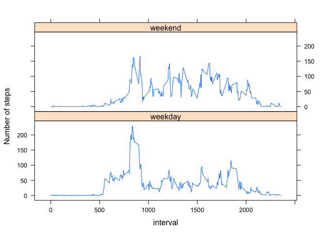

### Introduction
Peer Assignment1 : "PA1_template.Rmd"

### A. Loading and preprocessing the data
The data for this assignment is in the archive 'activity.zip'.
Variables in the data are:
1. steps: Number of steps taking in a 5-minute intervals (missing values are shown as NA).
2. date: The date on where measurement was taken in YYYY-MM-DD format
3. interval: Time identifier for the 5-minute interval where measurement was taken

```r
## read in the data and explore
data1 <- read.csv("activity.csv")
str(data1)
```

```
## 'data.frame':	17568 obs. of  3 variables:
##  $ steps   : int  NA NA NA NA NA NA NA NA NA NA ...
##  $ date    : Factor w/ 61 levels "2012-10-01","2012-10-02",..: 1 1 1 1 1 1 1 1 1 1 ...
##  $ interval: int  0 5 10 15 20 25 30 35 40 45 ...
```

```r
summary(data1)
```

```
##      steps               date          interval   
##  Min.   :  0.0   2012-10-01:  288   Min.   :   0  
##  1st Qu.:  0.0   2012-10-02:  288   1st Qu.: 589  
##  Median :  0.0   2012-10-03:  288   Median :1178  
##  Mean   : 37.4   2012-10-04:  288   Mean   :1178  
##  3rd Qu.: 12.0   2012-10-05:  288   3rd Qu.:1766  
##  Max.   :806.0   2012-10-06:  288   Max.   :2355  
##  NA's   :2304    (Other)   :15840
```

```r
class(data1)
```

```
## [1] "data.frame"
```

```r
## transform the data in date column into readable R format
convertDate <- as.Date(data1$date)
## create new data frame with convertDate
data2 <- data.frame(data1$steps, convertDate, data1$interval)
## rename colummns
colnames(data2) <- c("steps", "date", "interval")
head(data2)
```

```
##   steps       date interval
## 1    NA 2012-10-01        0
## 2    NA 2012-10-01        5
## 3    NA 2012-10-01       10
## 4    NA 2012-10-01       15
## 5    NA 2012-10-01       20
## 6    NA 2012-10-01       25
```


### B. Mean total number of steps per day

```r
## create table that sums up number of step per day
tableStep <- tapply(data2$step,data2$date, sum)
head(tableStep)
```

```
## 2012-10-01 2012-10-02 2012-10-03 2012-10-04 2012-10-05 2012-10-06 
##         NA        126      11352      12116      13294      15420
```

Histogram of total number of steps/day

```r
hist(tableStep, col = "blue", main="Total number of steps/day", xlab = "Number of steps")
```

 

```r
mean(tableStep, na.rm = TRUE)
```

```
## [1] 10766
```

```r
median(tableStep, na.rm = TRUE)
```

```
## [1] 10765
```
Mean number of steps: 10766
Median number of steps: 10765


### C. Average daily pattern
Create a time series of plot of 5-minute interval and average number of steps 

```r
# create average number of steps per interval across all days
library(plyr)
avgStepsPerInterval = ddply(data2, .(interval), summarize, steps=mean(steps, na.rm = TRUE))
head(avgStepsPerInterval)
```

```
##   interval   steps
## 1        0 1.71698
## 2        5 0.33962
## 3       10 0.13208
## 4       15 0.15094
## 5       20 0.07547
## 6       25 2.09434
```

```r
plot(avgStepsPerInterval$interval, avgStepsPerInterval$steps, type= "l", col = "blue", xlab = "time in hours",ylab = "Average number of steps/day", main = "Average number of steps across all intervals")
```

 

Get the 5-minute interval that has the maximum number of steps

```r
# get the row number for the interval with the highest steps
maxInterval = which.max(avgStepsPerInterval$steps)
avgStepsPerInterval[maxInterval, ]
```

```
##     interval steps
## 104      835 206.2
```
The 5-minute interval with maximum number of steps: 835


### D. Imputting missing values
Calculate rows with missing values

```r
good <- complete.cases(data2)
head(good)
```

```
## [1] FALSE FALSE FALSE FALSE FALSE FALSE
```

```r
table(good)
```

```
## good
## FALSE  TRUE 
##  2304 15264
```
Number of rows with missing values: 2304

#### Replacing rows with missing values (NA) with the average of the time intverval

```r
impute <- function(x, fun) {
  missing <- is.na(x)
  replace(x, missing, fun(x[!missing]))
}
replaceNA <- ddply(data2, ~ interval, transform, steps = impute(steps, mean))
head(replaceNA)
```

```
##    steps       date interval
## 1  1.717 2012-10-01        0
## 2  0.000 2012-10-02        0
## 3  0.000 2012-10-03        0
## 4 47.000 2012-10-04        0
## 5  0.000 2012-10-05        0
## 6  0.000 2012-10-06        0
```

Histogram of new dataset with replaced missing values

```r
tableStepNA <- tapply(replaceNA$step,replaceNA$date, sum)
head(tableStepNA)
```

```
## 2012-10-01 2012-10-02 2012-10-03 2012-10-04 2012-10-05 2012-10-06 
##      10766        126      11352      12116      13294      15420
```

```r
hist(tableStepNA, col = "red", main="Total number of steps/day", xlab = "Number of steps")
```

 

```r
mean(tableStepNA)
```

```
## [1] 10766
```

```r
median(tableStepNA)
```

```
## [1] 10766
```
Mean total number of steps: 10766 
Median total number of steps: 10766 

The values for mean is the same but the values for median differed very slightly between the dataset with or without missing data. 

Imputing missing data has no effect on the mean but has a tiny effect on the median for the estimates of the total daily number of steps.


### E. Differences between activity patterns in weekdays and weekends

```r
## convert the date factor to weekdays
convertToDate <- replaceNA$date
days <- weekdays(convertToDate)
## convert the days to return True if weekend
weekendCheck <- (days == "Saturday") | (days == "Sunday")
## create new data frame including add weekendCheck
data3 <- cbind(replaceNA, weekendCheck)
head(data3)
```

```
##    steps       date interval weekendCheck
## 1  1.717 2012-10-01        0        FALSE
## 2  0.000 2012-10-02        0        FALSE
## 3  0.000 2012-10-03        0        FALSE
## 4 47.000 2012-10-04        0        FALSE
## 5  0.000 2012-10-05        0        FALSE
## 6  0.000 2012-10-06        0         TRUE
```

```r
## convert weekendCheck to a factor variable, and rename them to "Weekend" and "Weekday"
data3$weekendCheck <- as.factor(data3$weekendCheck)
levels(data3$weekendCheck) <- c("weekday", "weekend")
head(data3)
```

```
##    steps       date interval weekendCheck
## 1  1.717 2012-10-01        0      weekday
## 2  0.000 2012-10-02        0      weekday
## 3  0.000 2012-10-03        0      weekday
## 4 47.000 2012-10-04        0      weekday
## 5  0.000 2012-10-05        0      weekday
## 6  0.000 2012-10-06        0      weekend
```

```r
## summarise avg number of steps for each interval across all weekdays or weekends
avgStepsInterval= ddply(data3, .(interval, weekendCheck), summarize, steps=mean(steps))
head(avgStepsInterval)
```

```
##   interval weekendCheck   steps
## 1        0      weekday 2.25115
## 2        0      weekend 0.21462
## 3        5      weekday 0.44528
## 4        5      weekend 0.04245
## 5       10      weekday 0.17317
## 6       10      weekend 0.01651
```

```r
## plot with lattice
library(lattice)
xyplot(steps~interval | weekendCheck, data = avgStepsInterval, type = "l", layout = c(1,2), xlab = "interval", ylab = "Number of steps")
```

 

Comparing between walking activities, there was a lot more walking in the morning compared to weekends.
